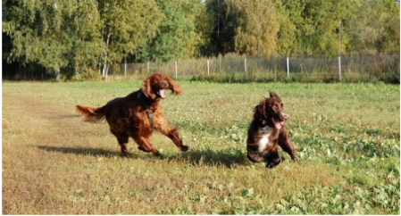

# ✨ Enhanced Image Captioning: Comparing Custom CNN-LSTM with BLIP-2 on Flickr8k ✨

     <!-- Choose your license -->

## 🚀 Introduction

Image captioning bridges the gap between **Computer Vision** and **Natural Language Processing**, enabling machines to describe the content of an image in human-like language. This capability has vast applications, from accessibility tools for the visually impaired to enhanced content retrieval and human-robot interaction.

This project, designed primarily for execution within **Kaggle Notebooks**, dives into this fascinating domain by implementing and comparing two distinct approaches on the popular **Flickr8k dataset**:

1.  **Custom Encoder-Decoder:** A classic architecture featuring a **MobileNetV2** CNN encoder (leveraging pre-trained weights) combined with an **LSTM** decoder to generate captions sequentially.
2.  **Pre-trained BLIP-2:** Utilizing the powerful, large-scale **BLIP-2** model (`Salesforce/blip2-opt-2.7b` checkpoint) via the Hugging Face `transformers` library for zero-shot captioning.

Our focus is not just on building these models but on providing a **direct qualitative comparison** of their captioning abilities, highlighting the strengths and trade-offs between training specialized models on moderate datasets versus leveraging massive pre-trained foundation models.

## 🌟 Key Features

*   🖼️ **Dataset Handling:** Efficient loading and preprocessing tailored for the Flickr8k dataset structure on Kaggle.
*   🛠️ **Custom Model:** Implementation of a MobileNetV2 + LSTM Encoder-Decoder model in PyTorch.
*   ⏱️ **Efficient Training:** Utilizes sequence packing and early stopping based on validation loss to optimize training time and prevent overfitting.
*   💾 **Best Model Saving:** Automatically saves the custom model weights that achieve the best validation performance.
*   🤖 **BLIP-2 Integration:** Seamlessly loads and runs the pre-trained BLIP-2 model for state-of-the-art zero-shot captioning.
*   📊 **Side-by-Side Comparison:** Generates captions from *both* models for the same test image, displayed alongside ground truth references for easy qualitative analysis.
*   📓 **Kaggle Optimized:** Setup and usage instructions specifically for Kaggle Notebook environments.

## 🖼️ Demo: Caption Comparison Example



**Reference Captions:**
> *   there are two large dogs running about in field.
> *   two brown dogs running in grass with fence and trees in the background.
> *   two brown dogs run through grassy field.
> *   two dogs are running in grassy field
> *   two red dogs running in green grass by fence

**Custom Model (MobileNetV2+LSTM) Caption:**
> 👉 `<SOS> two dogs are running in the grass`

**BLIP-2 (`opt-2.7b`) Caption:**
> 👉 ` two dogs running in the grass in a field`

*(This example demonstrates how both models capture the main elements, but BLIP-2 might offer slightly more descriptive language ["grass field" vs "grass"]. Actual results will vary.)*

## 📚 Dataset: Flickr8k

*   **Source:** A benchmark dataset collected from Flickr.com, widely used for image captioning research.
*   **Content:** 8,000 diverse images.
*   **Annotations:** Each image comes with 5 human-written reference captions.
*   **Kaggle Link:** [Flickr8k Dataset](https://www.kaggle.com/datasets/adityajn105/flickr8k)
*   **Split:** The script internally splits the data (by image ID) into Training (80%), Validation (10%), and Test (10%) sets.

## 🧠 Model Architectures

### 1. Custom CNN-LSTM Model

*   **Encoder:** Pre-trained MobileNetV2 (from `torchvision`). Extracts visual features. Base CNN weights are frozen.
*   **Decoder:** Single-layer LSTM network. Takes image features and previously generated words to predict the next word in the caption sequence.
*   **Workflow:** Image -> MobileNetV2 -> Feature Vector -> LSTM Input -> Word-by-Word Generation.

### 2. BLIP-2 Model

*   **Architecture:** Leverages a frozen pre-trained image encoder (like ViT), a lightweight Querying Transformer (Q-Former) to extract relevant visual features, and a frozen Large Language Model (LLM like OPT or Flan-T5) for text generation.
*   **Checkpoint Used:** `Salesforce/blip2-opt-2.7b` (via Hugging Face `transformers`).
*   **Workflow:** Image -> Frozen Image Encoder -> Q-Former -> Frozen LLM -> Caption Generation.

## 🔧 Technology Stack

*   **Language:** Python 3
*   **Core Libraries:** PyTorch, Hugging Face Transformers, Torchvision
*   **Data Handling:** Pandas, NumPy
*   **Utilities:** Pillow (PIL), tqdm, Matplotlib
*   **Environment:** Kaggle Notebooks (CPU/GPU)

## ⚙️ Setup & Usage (Kaggle Notebook)

This project is designed to run smoothly within a Kaggle Notebook environment.

1.  **Create Notebook:** Start a new Kaggle Notebook or open an existing one.
2.  **Add Data:**
    *   Click on "+ Add Data" in the right-hand pane.
    *   Search for the "Flickr8k" dataset (e.g., the one by `adityajn105`).
    *   Click "Add" next to the dataset. It will become available under the `/kaggle/input/` directory.
3.  **Verify Dataset Path:** The dataset will likely be mounted at a path like `/kaggle/input/flickr8k`. **Crucially, update the `BASE_DIR` variable** at the beginning of the script (`main_script.py` or your notebook) to match this path:
    ```python
    # In the script/notebook:
    BASE_DIR = '/kaggle/input/flickr8k' # Adjust if your dataset slug is different
    ```
4.  **Install Libraries (if needed):** While most are pre-installed, `transformers` and `accelerate` might need installation in the notebook:
    ```python
    !pip install -q transformers accelerate
    ```
    *(Run this in a code cell before importing these libraries)*
5.  **Enable GPU (Recommended):**
    *   In the right-hand pane, under "Settings" -> "Accelerator", select "GPU" (e.g., T4 x2, P100). BLIP-2 benefits significantly from GPU acceleration. *Note: BLIP-2 memory usage can be high.*
6.  **Run the Code:** Execute the cells of your notebook sequentially.
    *   **Training:** The custom model will train first. This can take a while depending on the accelerator. Monitor the training and validation loss. The best model based on validation loss will be saved (e.g., to `/kaggle/working/best_caption_model_earlystop.pth`).
    *   **Model Loading:** The script will then load the best saved custom model and the pre-trained BLIP-2 model (this might involve downloading weights on the first run).
    *   **Inference & Comparison:** Finally, it will perform individual tests and the combined comparison on random test images, printing captions and displaying images.

## 📈 Results Discussion

*   **Training:** The custom model demonstrates successful learning, with training and validation losses decreasing over epochs. Early stopping prevents significant overfitting on the Flickr8k validation set.
*   **Qualitative Comparison:** As seen in the demo (and further examples generated during runs), BLIP-2 generally produces more descriptive, fluent, and contextually rich captions due to its massive pre-training. The custom MobileNetV2-LSTM model captures the core subjects and actions effectively but tends to generate simpler sentence structures.
*   **Trade-offs:** Training a custom model provides fine-grained control but requires significant data and tuning for state-of-the-art results. Pre-trained models like BLIP-2 offer excellent performance out-of-the-box but come with higher computational requirements (memory, potentially inference time) and act more like a "black box".

*[Report](./Report/Image_Caption_Generator-v2.pdf)*

## 💡 Future Work

*   Integrate **Attention Mechanisms** into the custom decoder.
*   Implement **Beam Search** decoding for the custom model.
*   Experiment with different **CNN backbones** (ResNet, ViT) or **LLMs** (for BLIP-style models).
*   **Fine-tune** components (CNN base, BLIP-2 Q-Former/LLM adapter) on Flickr8k.
*   Train/evaluate on **larger datasets** (MS COCO, Flickr30k).
*   Add **quantitative evaluation** metrics (BLEU, CIDEr, METEOR).

## 📜 License

Distributed under the MIT License. See `LICENSE` file for more information.

## 👥 Authors

*   **Ali Zain** - K214653@nu.edu.pk
*   **Ali Shaz** - K213260@nu.edu.pk
*   **Bilal Ahmed** - K214864@nu.edu.pk


